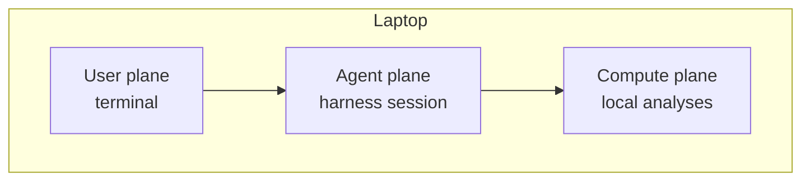
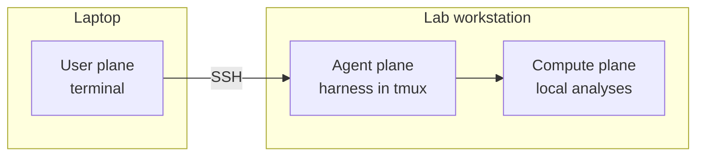
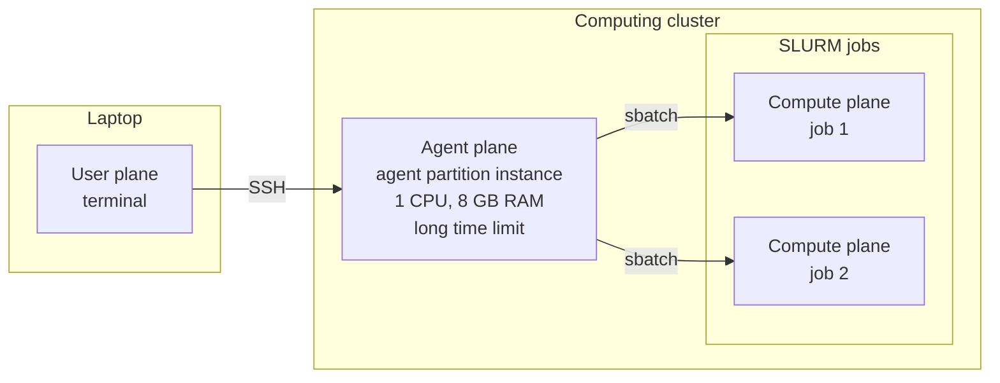

# Agent Concepts

Coding agents differ in their interfaces and configuration, but they share the same basic architecture. This chapter provides a conceptual template for understanding any of them. The next chapter, [Coding Agents](other-agents.md), maps Claude Code and Codex onto these concepts.

[Managing Security](managing-security.md) is about constraining an agent, [Managing Context](managing-context.md) about giving it the right information, and [Working Effectively](working-effectively.md) about directing its work. All three build on the vocabulary introduced here.

## Model, harness, agent, and tool

The terms *model* and *agent* are often used interchangeably, but the distinction matters:

| Concept | What it is | Examples |
|---|---|---|
| **Model** | The system that interprets context and decides what to say or do next | Claude, GPT |
| **Harness** | The software around the model that assembles context, offers tools, executes approved actions, and manages sessions | Claude Code, Codex |
| **Agent** | A model operating through a harness in a loop toward a goal | A Claude Code or Codex session working on a project |
| **Tool** | A bounded action the harness makes available to the model | Read a file, edit text, run a command, search the web |

Vendors do not always use *harness* consistently, but it is useful language. A model by itself does not have a working directory, edit files, run shell commands, remember project instructions, or decide when approval is required. The harness supplies those capabilities and constraints. The same model can be used through different harnesses, and some harnesses can use more than one model.

## The agent loop

An agent repeatedly:

1. observes the request, current context, and results of earlier actions;
2. decides on a response or tool call;
3. asks the harness to execute that tool call;
4. receives the result in its context; and
5. continues until it considers the task complete, reaches a gate, or needs input.

This loop is what makes an agent different from a chatbot that only returns one answer. A single prompt can lead to many file reads, edits, commands, tests, and revisions. The harness enforces the actual boundary: a model can propose an action, but it is the harness and its surrounding operating system that determine whether the action happens.

## Working directory and project

A local coding agent normally starts in a **working directory**, usually the root of a Git repository. This tells the harness where to focus, where to find project instructions, and which files belong to the task. It is a default scope, not necessarily a security boundary: depending on the harness and its settings, an agent may be able to read or write elsewhere.

Start the agent from the project root unless you deliberately want narrower scope. This also gives it the complete Git history, project-level instructions, tests, and planning files.

## Context

The **context** is the information the model can use at a particular moment. A harness assembles it from some combination of:

- your request and the conversation;
- standing project and user instructions;
- files the agent reads or that an editor supplies;
- tool definitions and skill descriptions;
- tool results, such as command output and search results; and
- saved memory or session state.

The agent does not automatically hold the whole repository in its mind. Context is finite, and large files, verbose command output, and long conversations compete for space. Good harnesses load some information progressively and let the agent retrieve more when needed. [Managing Context](managing-context.md) explains how to make the right information easy to find.

## Instructions, memory, and skills

Harnesses usually load standing instructions from plain-text files in or above the project. These record commands, conventions, constraints, and other facts that should apply across sessions. The filenames and precedence rules vary by product.

Some harnesses can also retain **memory** from earlier sessions. Treat it as a convenience rather than the authoritative project record: durable decisions belong in version-controlled files.

A **skill** is a reusable package of instructions, sometimes accompanied by scripts, references, or assets. Skills provide task-specific methods without placing every detail in the startup context. Product support and packaging differ, even where agents use the same underlying open format.

## Tools and extensions

The harness exposes tools to the model. Most coding agents include tools for reading and editing files, searching a repository, and running terminal commands. The terminal is especially powerful because it gives the agent access to ordinary command-line programs such as Git, test runners, data-analysis software, cluster schedulers, and the GitHub CLI.

Common extension mechanisms include:

| Mechanism | Purpose |
|---|---|
| **Tools** | Perform bounded actions such as reading, editing, searching, or running a command |
| **Skills** | Supply reusable, task-specific instructions and supporting resources |
| **Hooks** | Run deterministic code at defined points in the harness lifecycle |
| **Subagents** | Delegate bounded work into a separate context, sometimes in parallel |
| **MCP servers** | Connect the harness to external tools and data through the Model Context Protocol |
| **Plugins** | Bundle one or more extensions for installation and distribution |

Not every harness supports every mechanism, and identical names do not guarantee identical behavior.

## Permissions and sandboxing

Two controls are easy to confuse:

- An **approval policy** determines when the harness pauses to ask a person before acting.
- A **sandbox** determines what an action can technically access even if the model or user approves it.

An approval prompt is a workflow gate, not a security boundary. A sandbox, container, virtual machine, dedicated computer, or restricted account supplies the boundary. The safest useful setup combines an appropriate boundary with an approval policy that does not interrupt routine work. See [Managing Security](managing-security.md) for the practical consequences.

## Sessions and surfaces

A **session** is a continuing run with its conversation and accumulated state. Sessions may be interactive or unattended, local or remote, and exposed through a terminal, editor, desktop application, or web interface. Some harnesses can resume sessions or hand work between surfaces, but the exact state that travels varies.

Local and cloud agents can implement the same loop while running in very different environments. A local harness acts through your machine and credentials. A cloud harness normally works in a provisioned environment and returns a patch, branch, or pull request. For long-running local and remote work, see [Working Across Computers](working-across-computers.md).

## User, agent, and compute planes

When an agent runs analyses, three kinds of activity are involved. We call each one a **plane**:

| Plane | What happens there | What it needs |
|---|---|---|
| **User plane** | You read the agent's output, answer its questions, approve actions, and review results. | To be with you. This is typically your laptop, which you may turn on and off many times a day. |
| **Agent plane** | The harness runs the agent loop: reading files, editing code, calling the model, submitting and monitoring jobs, and checking results. | Long, uninterrupted persistence so a session can run for hours or days. Very little compute; 1 CPU and 8 GB of RAM are usually sufficient. Restrictions on what the agent can do, enforced by the plane itself, such as which files it can read and write. |
| **Compute plane** | The analyses themselves run. | Enough resources for the analysis, which may mean hundreds of gigabytes of disk, dozens of CPUs, and large amounts of RAM. |

The model itself runs on the provider's servers in every arrangement below. The planes describe where your side of the work happens.

If you run an agent on your laptop to do some analyses locally, all three planes are on the same machine. That is the simplest arrangement and often the right one. For more complex analyses it is often better to put the planes on different machines, because each plane is optimized differently:

- The user plane has to be where you are, but your laptop is a poor host for a long-running agent. If it sleeps or loses its network connection, the agent stops.
- The agent plane should be persistent and tightly bounded, but it barely uses resources. A small, always-on machine or a long-lived, low-resource allocation suits it well. Because it is dedicated to the agent, restrictions can be enforced at the level of the machine or account rather than relying on the harness alone (see [Permissions and sandboxing](#permissions-and-sandboxing)).
- The compute plane needs large resources, but often only for part of the time. These are frequently shared resources that you want to use only while you need them and then return immediately to the pool. Compute planes are therefore often ephemeral: the agent allocates them as needed, for example by submitting a job to a scheduler, and releases them when the job ends.

### Example: all planes on a laptop

You start the agent in a terminal on your laptop, and it runs analyses there. This suits work that fits on the laptop and finishes while you are present. Closing the laptop stops the agent and the analysis.

### Example: laptop and a lab workstation

You connect over SSH from your laptop to a headless Ubuntu computer that is always running in the lab. The agent runs on the workstation inside a persistent terminal session, such as `tmux`, and runs analyses on the same machine. The workstation is both the agent plane and the compute plane. You can close your laptop, reconnect later, and find the agent still working. The workstation's account and file permissions bound what the agent can reach.

### Example: laptop, agent allocation, and cluster jobs

You connect over SSH from your laptop to an agent running in a small, long-lived allocation on a computing cluster, such as an instance on a partition set aside for agents. That allocation is the agent plane. The agent then creates compute planes as needed by submitting SLURM jobs with the CPUs, memory, and disk each step requires. It monitors those jobs, and each job releases its resources when it finishes. The agent plane stays small and persistent, and each compute plane is large and ephemeral.

[Working Across Computers](working-across-computers.md) covers the practical tools for these arrangements: SSH, `tmux`, file transfer, and provenance across machines.

With this template in place, the meaningful questions about a coding agent become concrete: which model and context does its harness use, which tools can it call, where do its planes run, how is it constrained, and how does it preserve state? The next chapter answers those questions for Claude Code and Codex.
