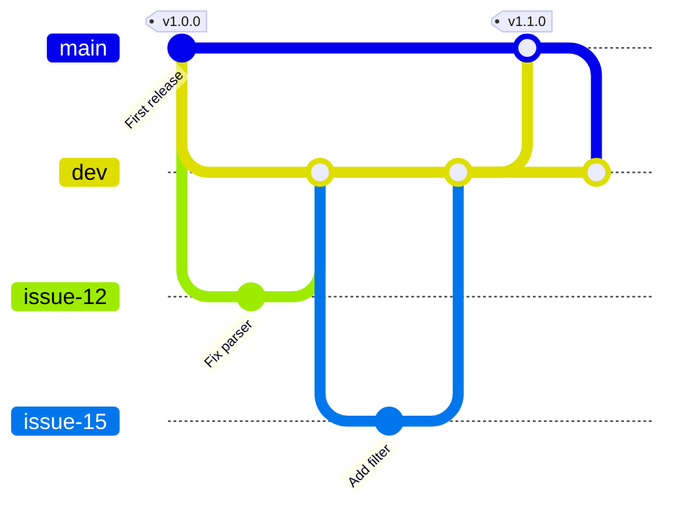

# Software Engineering

For the past couple of decades there has been a lot of emphasis on the idea that everyone should code. Learning to program is still valuable, even now that agents write code. You get the best results when you know what you are going for, and you need to be able to read and review the code an agent produces. But when agents write most of the code, a different skill becomes more important: **software engineering**.

Coding is writing instructions a computer can follow. Software engineering is deciding what to build, how its parts fit together, how you will know it works, and how it can change without breaking. When you direct an agent, you are the architect of the project, even if you never write a line yourself. The agent will make thousands of small decisions on your behalf, and the principles you set are what keep those decisions pointed the same way.

Some of this is entirely new territory for most biologists. A short script that runs once on one dataset may need very little engineering. But agents make much larger projects possible, such as a pipeline across hundreds of species or a tool that other labs install, and those projects fall apart without engineering practices that professional software developers take for granted. This chapter introduces those practices. [Working Effectively](working-effectively.md) covers how to plan and direct the work, and [Reproducibility](reproducibility.md) and [Correctness](correctness.md) cover what a result must satisfy. This chapter covers how to build something large that meets those standards.

## Principles behind the architecture

A few principles guide most good architectural decisions. You do not need to apply them yourself, but you should recognize them, ask for them, and notice when a plan or a piece of code ignores them.

- **Separate concerns.** Each part should do one job: reading inputs, filtering, statistics, and plotting belong in separate pieces, not one long script. Then a change to the plots cannot break the statistics, and each piece can be tested on its own.
- **Keep one source of truth.** Every fact should live in one place: a parameter in one configuration file, the list of samples in one table, the software version in one file. When the same fact is written in two places, they eventually disagree, and nothing tells you which is right.
- **Make the data flow visible.** You should be able to see which steps consume which files and produce which outputs. Hidden steps and files modified in place make results impossible to trace.
- **Never modify raw data.** Treat original inputs as read-only. Every later step writes new files, so you can always start over from the source.
- **Prefer boring, standard tools.** A well-known tool or file format that every agent and colleague understands beats a clever custom one.

## Testing: how you know it works

When an agent writes code faster than you can read it, tests become your main way to know that it works. A test is a small program that runs part of your code on a known input and checks that the output is what it should be. Tests also make the [agent-checkable gates](working-effectively.md#set-gates-the-agent-can-check) in your plan possible: "all tests pass" is something an agent can verify on its own.

There are several kinds, and a healthy project uses most of them:

| Kind | What it checks | Example |
|---|---|---|
| **Unit test** | One small piece of code does one thing correctly. | A function that computes GC content returns 0.5 for `ATGC`, handles lowercase letters, and handles an empty sequence without crashing. |
| **Integration test** | The pieces work together, from input to output. | The whole pipeline runs on a tiny dataset and produces the expected table. |
| **Smoke test** | The program runs at all on a realistic input, without crashing. It says nothing about correctness. | A pipeline run on one real sample finishes and writes non-empty files. |
| **Regression test** | Something that used to work still works. | When you find a bug, first add a test that reproduces it, then fix it; the test makes sure it never comes back. Comparing new output against a previously verified output catches unintended changes. |

All of these rely on **fixtures**: small, hand-checkable inputs where you know the right answer in advance, such as a FASTA file with ten sequences or a sample table with three rows. Good fixtures include the awkward cases the real data will eventually contain: an empty file, a duplicated identifier, a missing value. Your biological knowledge is especially valuable here. You know which edge cases occur in real data, and the agent may not.

The full set of tests is called the **test suite**. Run it after every change, and have it run automatically on GitHub whenever code is pushed. This is called **continuous integration**, or CI.

Your role in testing is to decide what must be true, not to write the tests:

- Read the test names. Together they should read like a specification: `test_gc_content_ignores_ambiguous_bases` tells you what the code promises.
- Ask the agent what is *not* tested, and whether that matters.
- Watch for tests that were changed to make them pass. An agent under pressure to finish may loosen a test instead of fixing the code. Changes to tests deserve a closer look than changes to the code they check.
- Remember that passing tests mean the code does what the tests say, not that the science is right. Keep the [scientific checks](working-effectively.md#set-gates-the-agent-can-check) too.

## Linting and formatting

Two more tools check code automatically, and they work differently from tests.

A **linter** reads code without running it and flags likely mistakes: a variable used before it is defined, an imported library that is never used, a comparison that is always true, a function that silently returns nothing on one path. A **formatter** rewrites the layout of code, such as indentation, line breaks, spacing, and quotation marks, into one consistent style without changing what it does. For Python, [Ruff](https://docs.astral.sh/ruff/) does both.

Linting and testing catch different problems:

- **A linter** inspects every line, including code no test ever runs, and finds whole classes of mistakes in seconds. But it cannot tell whether the code computes the right answer.
- **A test** runs the code and checks the answer. But it only checks the cases someone thought to write.

A project needs both, and both should run on every change.

It is worth having strong opinions about formatting, enforced by a tool rather than by taste. Without a formatter, every person and every agent session lays out code slightly differently. A change that should touch three lines then shows up as fifty, because the editor also reflowed the rest of the file, and the three lines that matter are hard to find among them. With a formatter run on every change, the code always looks the same, a reviewer sees only the lines that changed in meaning, and no one spends time debating style. The particular style matters much less than having one and applying it everywhere.

## Design for the person running it

Software has users, even when the only user is you in six months, or an agent in the next session. A few properties make the difference between a tool that is safe to run and one that has to be handled carefully.

**Make it idempotent.** An operation is idempotent if running it twice has the same effect as running it once. Analyses get interrupted, rerun, and resumed all the time, and a non-idempotent step turns each of those into a problem. A script that appends results to a file doubles them when run again. A script that writes a complete new file does not. A download step that fetches only files that are missing or incomplete can be rerun safely after a dropped connection. Idempotent steps let you, or an agent, simply run the analysis again after anything goes wrong.

**Provide a dry run.** A dry run reports what a command would do without doing it: which files it would create, which jobs it would launch, what it would delete. It is the cheapest possible check before anything slow, expensive, or destructive. It is especially valuable with agents, because you can ask to see the dry run before approving the real one.

A few more properties are worth asking for:

- **Fail early and clearly.** Check inputs at the start and stop with a message naming the file and the record that is wrong, rather than failing an hour later with an obscure error.
- **Never overwrite silently.** Write outputs to predictable places, and refuse to overwrite inputs or completed results unless asked.
- **Keep failures from leaving half-finished files**, which later steps might mistake for complete results.

## Workflow frameworks

An analysis with many steps, samples, or species quickly outgrows a single script. A **workflow framework** is a tool for exactly this. You describe each step in terms of the files it reads and the files it writes. The framework then works out the order, runs independent steps in parallel, sends jobs to a cluster when asked, and reruns only what needs rerunning. [Snakemake](https://snakemake.readthedocs.io/) and [Nextflow](https://www.nextflow.io/) are the two most widely used in biology. Both descend from `make`, a tool for building software that has worked this way since the 1970s.

### Snakemake rules

Snakemake is written in Python and is easy to read. A workflow is a set of **rules**. Each rule names its inputs, its outputs, and the command that turns one into the other:

```python
SAMPLES = ["liver", "brain"]

rule all:
    input:
        expand("results/{sample}.stats.tsv", sample=SAMPLES)

rule filter_reads:
    input:
        "data/{sample}.fastq.gz"
    output:
        "filtered/{sample}.fastq.gz"
    shell:
        "seqkit seq --min-len 50 {input} -o {output}"

rule summarize_reads:
    input:
        "filtered/{sample}.fastq.gz"
    output:
        "results/{sample}.stats.tsv"
    shell:
        "seqkit stats --tabular {input} > {output}"
```

`{sample}` is a **wildcard**: one rule covers every sample. The `all` rule lists the final results you want. Snakemake works backwards from them: to make `results/liver.stats.tsv` it needs `filtered/liver.fastq.gz`, and to make that it needs `data/liver.fastq.gz`. You never state the order; it follows from the files.

This design gives you the properties above without writing them yourself:

- **Idempotence is built in.** Snakemake runs a step only if its output is missing or out of date, for example because the input or the rule's code changed. Run the workflow twice and the second run does nothing. Interrupt it and the next run picks up where it stopped. If a step fails, Snakemake deletes its partial output, so a half-written file is never mistaken for a finished one.
- **Dry runs are built in.** `snakemake -n` lists every job it would run, and why, without running anything. Then `snakemake --cores 4` runs them.
- **The data flow is visible.** `snakemake --rulegraph` draws the steps and how they connect, which is often the clearest overview of an analysis.
- **The same workflow runs anywhere.** It can run on a laptop, or on a cluster as the [compute plane](working-across-computers.md#user-agent-and-compute-planes) with each rule submitted as its own job, without changing the rules.

Agents write Snakemake well, and the rules are short enough that you can read them to check what an analysis actually does. The [`dunnlab-workflow-design` skill](plugin.md#the-skills) describes how we organize Snakemake workflows.

## Prototyping: get something working end to end

The most common way large projects go wrong is perfecting the first step before the last step exists. You spend a week tuning read filtering, then discover at the final step that you needed different reads all along.

Instead, build a **minimum viable analysis** first: the simplest version of the whole analysis, from raw input to final figure, with every step as crude as it can be while still producing a result. It will not be good. But it shows you where the real problems are, gives you something to test from day one, and lets you improve the steps in the order that matters.

Develop against **small data**. Subsample your reads, take one chromosome, five species instead of five hundred, so each iteration takes seconds instead of hours. The agent can try ten variations in the time one full run would take. Move to the full dataset only once the small version works and passes its tests. The small dataset often becomes a fixture for the test suite.

Be clear about which code is a throwaway prototype and which will be kept. A prototype can be quick and untested. Code that will stay needs tests and documentation before the project depends on it.

## Breaking a large problem into increments

A large goal, such as "infer a phylogeny of all sequenced cnidarians", cannot be checked in one step. Break it into **increments**: smaller goals that each produce something you can check, where each one builds on the last.

Good increments share a few properties:

- **Each one delivers something checkable**, not just progress. "Download and validate all proteomes" is an increment. "Work on downloads" is not.
- **They are ordered by dependency and by risk.** Do first whatever is most uncertain or most likely to change the plan. If you are unsure the data even support the analysis, find out before building anything that assumes they do.
- **Each one is small enough to review.** If you could not review the result in one sitting, split it further.

Between increments, put **gates**: the criteria an increment must meet before the next one starts. [Working Effectively](working-effectively.md#set-gates-the-agent-can-check) explains how to write gates an agent can check on its own. Here, the point is where they go. A gate at the end of each increment means a problem is caught where it started, rather than three increments later. Most gates should be agent-checkable, so work continues without you. Reserve human gates for decisions that need your judgment, such as which of two scientific interpretations to pursue.

## From plan to checklist

The concepts above come together in the project plan. [Working Effectively](working-effectively.md#commit-the-plan-for-anything-large) explains why the plan should be a file in the repository. Here is what goes in it for a software project:

- **The goal:** what users will be able to do when the work is done.
- **Scope:** what is included, and just as important, what is not.
- **The increments,** in order, each with its gate.
- **Open decisions** that still need you.

Once the plan settles, turn the increments into a **checklist**: one line per step, each with its gate and a status. A checklist is what lets an agent work for hours unattended. It always knows the next step and how to tell when that step is done, and you can see at a glance how far it has got.

```markdown
- [x] Validate input FASTA files. Gate: validator passes on all 212 files.
- [ ] Remove within-species duplicates. Gate: no species has two sequences in any gene.
- [ ] Align and trim. Gate: every alignment keeps at least 50 sites; you review 5 at random.
```

## Track the work as GitHub issues

Once a project has more than a handful of steps, or more than one person, keep each unit of work as a **GitHub issue**. An issue is a numbered task in the repository's tracker. It describes a problem or a change, holds the discussion about it, and is closed when the work is done. Agents file, read, and close issues with GitHub's `gh` command, so you can ask for them in plain language.

A good issue states:

- the problem or the desired outcome;
- why it matters; and
- how to tell it is done, which is the step's gate.

Issues and the plan divide the work between them. The **issue** holds the detail and the discussion for one step. The **plan** holds the order: which issues come first, which depend on which, and the gate on each. A plan that lists issue numbers in sequence is short, readable, and always points to the full story.

## Release cycles

For a small project you use yourself, working directly on the main copy of the code is fine. But once other people use the code, more than one person contributes, or an agent works unattended for long stretches, you need a way to change the code without breaking it for everyone who depends on it. That is a **release cycle**.

A **release** is a version of the software that has been checked and given a number, such as `1.2.0`. Users run releases. Development continues between releases without disturbing them. Version numbers usually follow [semantic versioning](https://semver.org/): the last number changes for fixes, the middle number for new features, and the first number for changes that could break how people use it. A **changelog** file lists what changed in each release, in words users understand.

### Branches: work on dev, release on main

Git keeps the project's history in **branches**: parallel lines of development that can later be **merged**. The model we use has three kinds:

- **`main`** holds released versions only. Anyone who takes the code from `main` gets something that was checked.
- **`dev`** collects work for the next release.
- **Issue branches**, one per issue, hold the work in progress. When the work is ready, it is merged into `dev` through a **pull request**: a request to merge that shows the changes and runs the test suite before anything is combined.



This separation is what lets an agent work freely. It can try things on issue branches and merge into `dev` when tests pass, while `main` stays safe. GitHub can enforce the rules, refusing any change to `main` that has not gone through a pull request with passing tests, so no one has to remember them.

### The release ritual

Releasing is a fixed sequence of steps, done the same way every time. Hence the name **release ritual**. A typical ritual:

1. Run every check: the full test suite, plus the formatting and code-quality checks.
2. Confirm every gate in the plan has passed.
3. Set the version number and finish the changelog entry.
4. A person approves the release.
5. Merge `dev` into `main`, and mark that point in the history with a **tag** naming the version.
6. Publish the release, for example as a GitHub release.
7. Return to `dev`: bring the release back into it, start the next version, and update the plan.

It is called a ritual because skipping a step, even one that seems like cleanup, is how projects drift into confusion. A missed step 7 leaves `dev` and `main` disagreeing about what was released, and untangling that later takes far longer than the step would have.

The [`dunnlab-release-cycle` skill](plugin.md#the-skills) sets up this cycle for a project, including the plan, the branch rules, and the ritual. It also tells agents how to work within it.

## Just because you can does not mean you should

Agents make adding things nearly free. Another option, another output format, support for another input type, a dashboard: each one takes minutes to request. But the cost of a feature was never mainly the time to write it. Every addition must be tested, reviewed, documented, and understood. It is another place for bugs to hide, and it adds to what you and every future agent must hold in mind to change the project safely.

Constraint is good. Much of the art of engineering is deciding what not to do:

- **Write down what is out of scope**, in the plan, so neither you nor the agent drifts into it.
- **Build for the need you have now,** not the one you might have someday. Code that handles hypothetical future cases is code you maintain for nothing until that day comes, and the day often never comes.
- **Provide one way to do each thing.** Every option or alternative path doubles what must be tested.
- **Decline extras.** Agents often offer to add more. Ask what it would cost to keep, not just what it would do.
- **Ask what can be removed.** Deleting unused code, outputs, and options is one of the most valuable changes a project can make.

A small project that does one thing well, and that you understand completely, is worth more than a large one that does many things you cannot vouch for.
