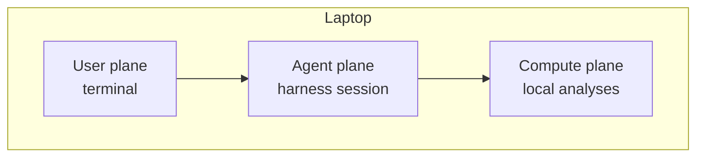
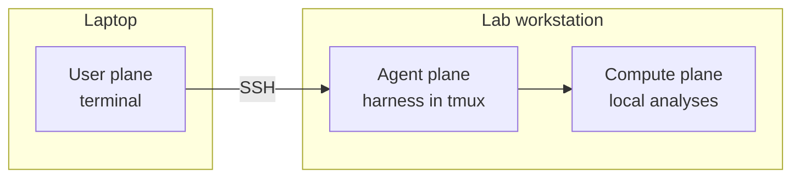
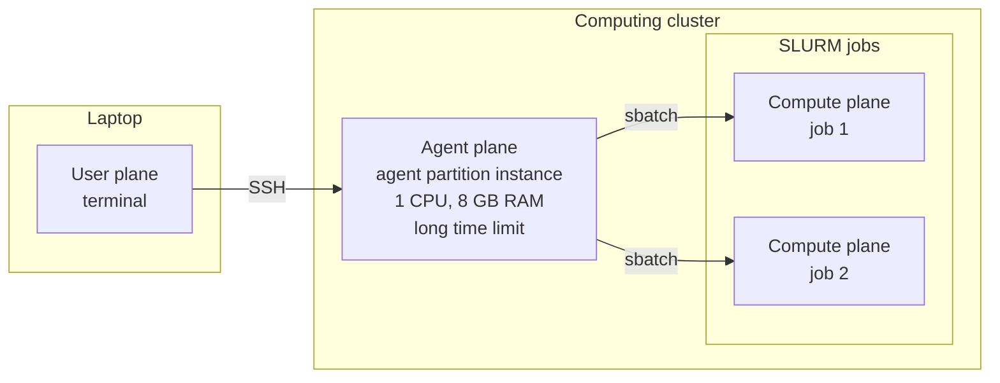

# Working Across Computers

Once your work is organized around a terminal, text files, and Git, it becomes natural to split it across computers. The agent does not have to run on the same machine as you, and the machine running the agent does not have to perform the heavy computation.

## User, agent, and compute planes

When an agent runs analyses, three kinds of activity are involved. We call each one a **plane**:

| Plane | What happens there | What it needs |
|---|---|---|
| **User plane** | You read the agent's output, answer its questions, approve actions, and review results. | To be with you. This is typically your laptop, which you may turn on and off many times a day. |
| **Agent plane** | The harness runs the agent loop: reading files, editing code, calling the model, submitting and monitoring jobs, and checking results. | Long, uninterrupted persistence so a session can run for hours or days. Very little compute; 1 CPU and 8 GB of RAM are usually sufficient. Restrictions on what the agent can do, enforced by the plane itself, such as which files it can read and write. |
| **Compute plane** | The analyses themselves run. | Enough resources for the analysis, which may mean hundreds of gigabytes of disk, dozens of CPUs, and large amounts of RAM. |

The model itself runs on the provider's servers in every arrangement below. The planes describe where your side of the work happens.

### Why separate them

If you run an agent on your laptop to do some analyses locally, all three planes are on the same machine. That is the simplest arrangement and often the right one. Two needs push the planes apart as work grows:

**Isolation.** A dedicated computer, cloud virtual machine, or separate account can hold only one project and narrowly scoped credentials. The agent can work autonomously there without being able to reach your email, browser profile, private files, or unrelated repositories. This is a practical extension of the boundaries in [Managing Security](managing-security.md#system-level-control).

**Compute.** Some analyses need more memory, CPUs, GPUs, storage, or runtime than a laptop can provide. A workstation, cloud instance, or high-performance computing cluster can run the analysis while your local computer remains available for ordinary work.

More generally, each plane is optimized differently:

- The user plane has to be where you are, but your laptop is a poor host for a long-running agent. If it sleeps or loses its network connection, the agent stops.
- The agent plane should be persistent and tightly bounded, but it barely uses resources. A small, always-on machine or a long-lived, low-resource allocation suits it well. Because it is dedicated to the agent, restrictions can be enforced at the level of the machine or account rather than relying on the harness alone.
- The compute plane needs large resources, but often only for part of the time. These are frequently shared resources that you want to use only while you need them and then return immediately to the pool. Compute planes are therefore often ephemeral: the agent allocates them as needed, for example by submitting a job to a scheduler, and releases them when the job ends.

These needs do not call for the same machine. A cheap remote machine may be an excellent agent plane and a poor compute plane; an HPC cluster may be an excellent compute plane and an inappropriate place to run an autonomous agent.

### Example: all planes on a laptop

You start the agent in a terminal on your laptop, and it runs analyses there. This suits work that fits on the laptop and finishes while you are present. Closing the laptop stops the agent and the analysis.



### Example: laptop and a lab workstation

You connect over SSH from your laptop to a headless Ubuntu computer that is always running in the lab. The agent runs on the workstation inside a persistent terminal session, such as `tmux`, and runs analyses on the same machine. The workstation is both the agent plane and the compute plane. You can close your laptop, reconnect later, and find the agent still working. The workstation's account and file permissions bound what the agent can reach.



### Example: laptop, agent allocation, and cluster jobs

You connect over SSH from your laptop to an agent running in a small, long-lived allocation on a computing cluster, such as an instance on a partition set aside for agents. That allocation is the agent plane. The agent then creates compute planes as needed by submitting SLURM jobs with the CPUs, memory, and disk each step requires. It monitors those jobs, and each job releases its resources when it finishes. The agent plane stays small and persistent, and each compute plane is large and ephemeral.



## Choosing an arrangement

The user plane stays with you. The arrangements differ in where the agent and compute planes go:

| Arrangement | Best for | Main caution |
|---|---|---|
| **Remote agent, remote compute** | A dedicated workstation or VM where the agent can code and run moderate analyses unattended. | The remote machine still needs narrowly scoped credentials and backups through Git. |
| **Local agent, remote compute** | Keeping the agent on your own machine while using a cluster, GPU server, or cloud instance for heavy jobs. | SSH access gives the local agent reach into the remote system; constrain that reach deliberately. The agent stops whenever your computer sleeps, so submitted jobs continue unmonitored. |
| **Agent on shared infrastructure** | Work whose code and data already live there, when policy explicitly permits agents. | Shared filesystems, login-node rules, and weak sandbox support raise the stakes. |

Keeping the agent local is a simple way to start: the agent remains in a familiar, controlled environment but can drive a much larger compute resource entirely through command-line tools. When sessions need to run for hours or days, move the agent plane to a persistent machine or allocation.

## Connect with SSH and transfer with SCP

[SSH](https://www.openssh.com/manual.html) gives you a shell on another computer through an encrypted connection:

```bash
ssh user@analysis-box
```

Put stable hostnames, usernames, and identity choices in `~/.ssh/config` so people and agents use a short, consistent host alias. Never paste a private key into a prompt or repository.

[SCP](https://man.openbsd.org/scp) uses the same SSH connection and authentication to copy files in either direction:

```bash
scp analysis.R analysis-box:/remote/project/scripts/       # upload
scp analysis-box:/remote/project/results/summary.csv ./    # download
scp -r figures/ analysis-box:/remote/project/results/      # copy a directory
```

Usually the agent will drive `scp` directly. Tell it what needs to move and why; it can inspect both locations, resolve the exact paths, run the command, and verify the destination afterward. Your job is to make sure the source, destination, and data-access decision are appropriate. This is especially important because `scp` has no dry-run mode and can overwrite an existing destination.

`scp` is a good fit for a small, one-off transfer. For a large directory or a transfer that will be repeated, prefer `rsync`, a transfer node, or a managed service: they can avoid retransmitting unchanged files and cope better with interrupted work.

[VS Code Remote SSH](https://code.visualstudio.com/docs/remote/ssh) can open the remote directory in the same editor you use locally, while the integrated terminal runs on the remote host. Ask your agent to explain SSH, help configure an alias, or diagnose a connection; complete authentication and host-verification decisions yourself.

## Keep remote sessions alive with tmux

An SSH connection is temporary. If your laptop sleeps, Wi-Fi changes, or the terminal closes, every ordinary foreground process on the remote machine dies with it. [`tmux`](https://github.com/tmux/tmux/wiki) keeps a terminal session alive so you can disconnect and return later:

```bash
tmux new -s project
# Ctrl-b d detaches while the session keeps running
tmux ls
tmux a -t project
```

`Ctrl-b d` is the key sequence to remember: press `Ctrl-b`, release it, then press `d`.

{: .note }
> **tmux is not a compute scheduler.**
>
> It keeps an agent, shell, monitor, or lightweight workflow controller alive after SSH disconnects. On a cluster, heavy analysis belongs in a scheduled job, which will continue independently after submission whether or not `tmux` is running.

This repository includes a [tmux configuration and cheat sheet](https://github.com/caseywdunn/dunnlab_code/tree/main/assets/tmux) with named sessions, long scrollback, and clipboard support that works over SSH.

## Let a local agent control remote computation

The agent can stay on your local computer and treat the remote machine as a command-line resource. A typical run looks like this:

1. Keep the plan, code, configuration, and job scripts in a Git repository.
2. Have the agent implement and test a small local or reduced-data pilot.
3. Transfer or update the code on the remote system, and identify the remote data without modifying the raw source.
4. Submit the job over SSH with the remote scheduler or workload manager.
5. Monitor job state, resource use, logs, and the gates defined in the plan.
6. Retrieve compact results needed for review, then commit any code, documentation, or plan changes.

On a [Slurm](https://slurm.schedmd.com/overview.html) cluster, for example, the local agent can use SSH to run `sbatch`, capture the returned job ID, query it with `squeue` and `sacct`, inspect log files, cancel it when necessary, and submit the next stage only after its gate passes.

This arrangement can keep the AI client itself off shared infrastructure while still letting it orchestrate analyses there. Whether that satisfies local policy depends on what the agent can read through SSH and what information it sends to the model, not merely where its process runs.

## Move the right things in the right way

Use different mechanisms for different material:

| Material | Preferred route |
|---|---|
| **Code, plans, configuration, and documentation** | Git and GitHub. Commit locally and pull remotely, or the reverse. |
| **Raw data** | Keep one authoritative, immutable copy in approved storage. Give the agent read-only access where possible. |
| **Small one-off transfers** | `scp`, using the same host alias and credentials as SSH. Have the agent verify the destination after copying. |
| **Large inputs and outputs** | [`rsync`](https://rsync.samba.org/), a transfer node, object storage, or a managed service such as [Globus](https://www.globus.org/), according to institutional guidance. |
| **Logs and compact results** | Copy back what is needed for review and interpretation; leave bulky reproducible intermediates near the compute. |

Establish which copy is authoritative before automating transfers. Avoid casual two-way synchronization, especially for raw data: when both sides can overwrite each other, a mistaken command can propagate damage instead of merely making a bad copy.

## Preserve provenance across machines

A second computer should not create a second, disconnected history. For every substantial run:

- Record the Git commit used for the analysis.
- Record the job ID, submission command, requested resources, and input locations.
- Capture the environment definition and tool versions in tracked files.
- Keep logs with enough context to connect outputs back to the run that produced them.

That makes the compute plane replaceable. [Reproducibility](reproducibility.md) covers the rest of what a result needs in order to be regenerated. You should be able to move the same committed code and environment description to another machine and understand what differs.

## Security and policy still apply

A dedicated machine with no private data is a strong boundary, but “remote” does not mean “safe.” The machine may still hold SSH keys, cloud tokens, unpublished results, or network access to other systems.

- Give it credentials scoped to one project and only the remote actions it needs.
- Check institutional and provider policies before installing an agent or exposing data to one.
- Keep raw and sensitive data outside the agent's readable paths unless its use is explicitly approved.
- Never run heavy work on a shared login node; submit it through the scheduler.

{: .warning }
> **Separating the agent and compute planes does not automatically separate the agent from the data.**
>
> If a local agent can run `ssh cluster cat sensitive-file`, it can read that file and potentially send its contents to the model. Enforce the boundary with accounts, filesystem permissions, restricted credentials, and approved data paths rather than relying on where the agent process happens to run.

## Choose the simplest arrangement that fits

- **Dedicated remote machine:** choose this when isolation and long autonomous sessions matter most.
- **Local agent with remote compute:** choose this when the cluster or server is primarily a source of capacity and command-line access is sufficient.
- **Agent on the cluster:** choose this only when policy permits it and the benefits outweigh the broader shared-system risk.

Start with one agent plane and one authoritative repository. Add file transfer and remote execution deliberately, pilot the complete path on a small job, and put a gate between submission, retrieval, and interpretation.

For institution-specific cluster policy and examples, see [Computing at Yale](yale.md). For the short session commands, see [Quick Reference](quick-reference.md#remote-work-with-tmux).
