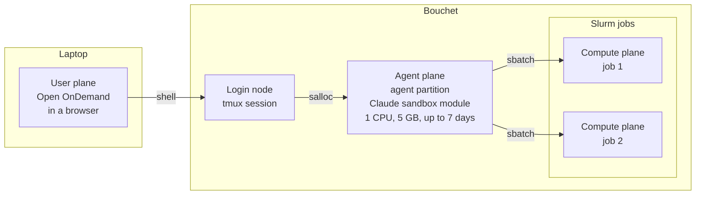

# Computing at Yale

Everything up to this point applies anywhere. This chapter does not: it covers Yale's research computing environment and how to use Claude Code or Codex with it safely.

Start with [Working Across Computers](working-across-computers.md) for the general pattern: SSH, persistent sessions, file movement, and keeping the agent plane separate from scheduled computation.

If you are reading this from another institution, the useful part is the shape rather than the specifics — most universities have an equivalent of the policies and constraints below, and the reasoning transfers even though the hostnames do not.

## High performance computing

We make extensive use of Yale's High Performance Computing (HPC) resources at the [Yale Center for Research Computing](https://docs.ycrc.yale.edu/clusters/). YCRC maintains detailed [documentation](https://docs.ycrc.yale.edu/clusters-at-yale/) on using the clusters, including the [SLURM](https://docs.ycrc.yale.edu/clusters-at-yale/job-scheduling/) scheduler you will use to launch and run analyses.

Most interaction with the clusters happens through [Open OnDemand](https://docs.ycrc.yale.edu/clusters-at-yale/access/ood/#remote-desktop), YCRC's web portal.

## Coding agents and the clusters

[Agents on shared clusters](working-across-computers.md#agents-on-shared-clusters) covers the general precautions: start with restrictive permissions, check that the sandbox works, and keep heavy work off login nodes. This section adds what is specific to Yale.

### Follow YCRC guidance first

YCRC publishes [guidance on AI coding agents](https://docs.ycrc.yale.edu/ai/aicodingtools/). Read it before using an agent on the clusters. These tools are new and the guidance may change faster than this page does; where the two disagree, YCRC wins. At the time of writing, YCRC offers two approaches:

- **[Local coding agents](https://docs.ycrc.yale.edu/ai/local-coding-agents/)** on Bouchet use a model hosted by YCRC, so prompts and data do not leave Yale. They provide several interfaces, including Claude Code and Codex, through `module load local-coding-agents/1.0`, and need no commercial account.
- **[Commercial coding agents](https://docs.ycrc.yale.edu/ai/commercial-coding-agents/)** use models hosted by external providers, so prompts, code, and data leave YCRC. YCRC is testing a sandbox module for Claude Code, `module load claude`. It checks where Claude starts, removes sensitive environment variables, runs Claude in a container that limits which files it can see, and enforces YCRC's permission policies through managed settings.

Two rules apply to both:

- **Run agents on a compute node,** never on a login node, started from a non-hidden subdirectory of your home, project, scratch, or PI storage.
- **Respect the data restrictions.** With commercial agents, use only low-risk data for now; YCRC expects to allow medium-risk data once Claude Enterprise is available. Never use PHI or other high-risk data with a commercial agent.

### A long-running agent on Bouchet

Bouchet has an `agent` partition for exactly the arrangement described in [Working Across Computers](working-across-computers.md#user-agent-and-compute-planes): a small allocation, 1 CPU and up to 8 GB of memory, that can run for up to 7 days. The agent runs there with an uninterrupted session and launches the real analyses as separate Slurm jobs. McCleary has no equivalent partition at the time of writing.



1. **Sign in to Bouchet through [Open OnDemand](https://docs.ycrc.yale.edu/clusters-at-yale/access/ood/)** and open a shell. This puts you on a login node.
2. **Start a tmux session,** so the agent keeps running when you close the browser:

   ```bash
   tmux new -s claude
   ```

3. **Within it, request a 7-day allocation on the `agent` partition:**

   ```bash
   salloc -p agent -t 7-00:00:00 --cpus-per-task=1 --mem=5G
   ```

   When the allocation starts, your shell is on a compute node.
4. **Start Claude in the sandbox,** from your project directory:

   ```bash
   cd ~/project_pi_<netid>/my-analysis
   module load claude
   claude
   ```

5. **Detach and come back later.** Press `Ctrl-b`, then `d`, to leave the session running. To return, open a shell again and run `tmux a -t claude`. A tmux session lives on one login node, so note the node's name with `hostname` when you start. If a later shell lands on a different login node, `ssh` to the original one first.

From there, the agent submits analyses with `sbatch`, monitors them with `squeue` and `sacct`, and checks their results, each job requesting the resources its step needs and releasing them when it finishes. The agent's own allocation stays small. When the 7 days run out, the agent stops; start a new allocation the same way and resume the conversation with `claude -c`. Jobs it submitted keep running regardless.

### Cluster reference for agents

Give agents the cluster's details (partitions, storage paths, Slurm templates, and the conda workflow) in a document such as `dev_docs/cluster.md`, with a one-line pointer to it in `AGENTS.md`, so every agent can find it without filling the always-loaded instructions. The `dunnlab-hpc` skill carries the same reference for Claude Code.

This repository's [tmux configuration and cheat sheet](https://github.com/caseywdunn/dunnlab_code/tree/main/assets/tmux) includes clipboard support that works over SSH.
