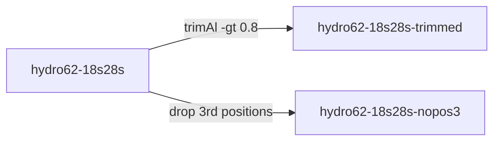

# Phase 3: Distillation

Build the analyses the paper actually reports. Priorities, in order when they conflict: **reproducibility, simplicity, clarity** — subject to achieving the scientific goals.

The product has to be *human auditable*. A reader with the repo open should be able to see what was run without an agent interpreting the code back to them. If understanding the analysis requires an LLM, the analysis is not auditable, and no amount of available code fixes that.

## Distillation is a rewrite

Move every existing analysis into `exploratory/` — including the ones the paper reports — and build the distilled set new from `dev_docs/analysis-spec.md`.

This costs a full recompute, so it is worth being clear about why pruning is not enough. Analyses that survive a pruning keep the shape exploration gave them: names that encode when they were run, three matrix variants whose differences nobody can state, parameters that drifted between runs because they were set by hand. Those are the properties that make the set hard to audit, and they are inherited, not fixed, by deleting the neighbours. Rebuilding from a spec makes the command template and the analysis table honest by construction — they describe the runs because the runs were generated from them.

If the recompute is genuinely unaffordable — months of cluster time — say so and propose the alternative explicitly rather than quietly pruning. That is the user's tradeoff to make, not yours.

## Filenames encode identity

Use Snakemake-style names: the matrix short name first, then one field per wildcard, dot-delimited.

```
hydro62-18s28s.gtr-g.ufboot.treefile
hydro62-18s28s-trimmed.gtr-g.ufboot.treefile
hydro62-18s28s.partitioned.ufboot.treefile
```

Read that name and you know which row of the analysis table produced it. Nothing in a distilled filename records *when* it ran, what order it came in, or which attempt it was — that is exploratory provenance, and it belongs in git history, not the filename. This is a deliberate departure from the ISO-date prefixes `dunnlab-defaults` recommends for versioned data files; dates are the right choice while things are changing and the wrong one once they are fixed.

Matrix short names carry taxon sampling, gene region, and optional processing, one field each:

```
hydro62-18s28s            62 hydrozoan taxa, 18S + 28S
hydro62-18s28s-trimmed    the same, after trimAl
siph31-cox1               31 siphonophore taxa, COI
```

Keep them short enough to use as filenames and meaningful enough to read in a table. The same short name is the matrix's identity everywhere: filename, manifest row, methods table, figure caption.

## The matrix set is minimal

A matrix exists because an analysis in the spec requires it. Not because it was built once during exploration, and not because it might be useful.

Where two analyses can share a matrix, they share it. Where matrices must differ, the difference has to be statable in one clause — "the same as `hydro62-18s28s` with third codon positions removed." If you cannot say what distinguishes two matrices in a clause, that is the signal they should be one matrix.

Record derivation explicitly, because "trimmed version of" is the relationship readers most often need and most often cannot find:



## One seed

Set a single random seed in the workflow config and report it once in the methods. Every analysis uses it.

The exception is replication, where variation across runs is the point. Then the seed becomes a wildcard like any other and gets a column in the analysis table — which is the honest representation, since the runs genuinely differ.

## The manifests are generated, not written

This is the heart of the phase. The workflow emits two tables; both are committed; the methods sections render from them.

`analyses/manifests/matrices.tsv` — one row per matrix:

| name | description | taxa | sites | occupancy | derived_from |
|---|---|---|---|---|---|
| hydro62-18s28s | 62 hydrozoans, 18S + 28S | 62 | 4184 | 0.87 | — |
| hydro62-18s28s-trimmed | trimAl -gt 0.8 | 62 | 3102 | 0.94 | hydro62-18s28s |

`analyses/manifests/analyses.tsv` — the command template in the header, one row per run, one column per wildcard:

| matrix | model | support | seed |
|---|---|---|---|
| hydro62-18s28s | GTR+G | ufboot1000 | 12345 |
| hydro62-18s28s-trimmed | GTR+G | ufboot1000 | 12345 |

Generate these from the run itself — read the alignments for the matrix statistics, read the workflow's own parameters for the analysis rows. `scripts/matrix_stats.py` in this skill computes taxa, sites, and occupancy from FASTA, PHYLIP, or NEXUS alignments; use it rather than writing another one.

The reason this matters more than it may appear: a table written by reading the code can drift from what ran, and cannot be checked without redoing the reading. A table generated by the run cannot drift, and Validation checks it by regenerating and diffing. This is what removes the need for an agent to interpret the analysis — the audit artifact is mechanical.

Report the tool version alongside the template. Capture it from the tool (`iqtree2 --version`), do not transcribe it.

## Do not recapitulate exploration

The distilled analysis should read as though it had been designed this way from the start, because the spec means it was.

Concretely: datasets that arrived at different times during exploration are the same class of data in the distilled analysis. There is no "initial" and "additional" sampling, no `_v2` matrices, no parameters carrying a comment about why they were changed. Those distinctions are the history of your thinking, and while that history is real and sometimes belongs in the paper's discussion, encoding it in the analysis structure forces every reader to learn your search path before they can evaluate your result.

## What else belongs in `analyses/`

Distillation is not only the workflow. Include:

- **Data acquisition scripts** that fetch raw data from public repositories by accession, so the analysis starts from something a stranger can obtain.
- **Input validation** that checks assumptions before the expensive steps — expected taxa present, no duplicate IDs, sequences in the expected alphabet. See `dunnlab-bioinformatics`.
- **Tests**, including at least one known-answer case small enough to run in CI.
- **A configuration file** holding the seed, paths, and parameters, so nothing consequential is buried in a command line.

## AI comes off the data path

Every distilled analysis must rerun from raw data to results without invoking a language model. That is the operational test, and it is checkable: rerun it with no model available.

Anything AI did during exploration has to be either reduced to committed code — the usual case, since most of it was munging, filtering, or formatting that a script does deterministically — or kept on the path deliberately, because the capability genuinely cannot be reduced to a fixed pipeline. On-path steps are legitimate but carry obligations: record the model and version, preserve prompts and schemas in the repo, and verify the output by task-appropriate checks. `docs/using-ai.md` in the dunnlab_code repo covers what to record.

If you find yourself keeping a model on the path because rewriting it as code is tedious, that is the wrong reason, and it is the single most common way analyses become unreproducible.

## Gate: it runs

This is the point to pick up the incremental build discipline from `dunnlab-new-project` Stage 8 — atomic tasks, tests and docs per task, commit between — which Exploration deliberately skipped. Its Stage 9 checklist covers the engineering side of the gate below; run it rather than duplicating it.

Check by running it, from a clean state:

- [ ] The workflow completes from raw data to final outputs with no manual steps
- [ ] No LLM is invoked anywhere on the path, or on-path steps are documented with model, version, and verification
- [ ] Every output filename parses into its analysis table row
- [ ] `matrices.tsv` and `analyses.tsv` regenerate and match what is committed
- [ ] Every matrix in the manifest is used by at least one analysis
- [ ] Every analysis in the spec has produced output, and nothing outside the spec has
- [ ] Tests pass, including the known-answer case
- [ ] A fresh clone plus the environment file reproduces the run

Report which of these you actually ran and what they showed. An unchecked box is more useful than one ticked on inspection.
